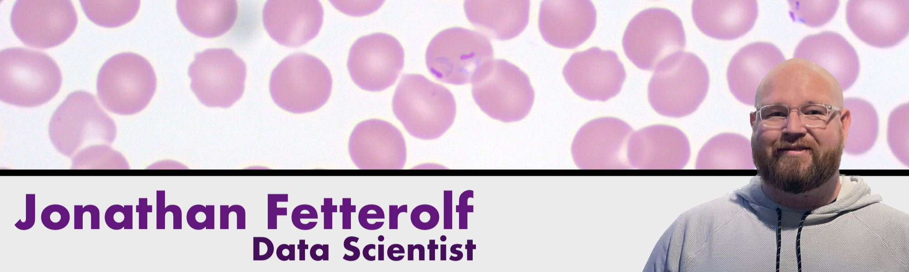

## Hey, hi, how ya doin'? 👋

I'm Jonathan Fetterolf and I'm an innovative and dynamic data scientist with a leadership background in the food/beverage and retail industries. Experienced in data acquisition/cleaning, statistical analysis, and data visualization. I excel at problem solving, communicating clearly, and balancing the ambiguity of autonomy and collaboration. I am currently a technical intern at a technology solutions company that specializes in enterprise data management. 

## Recent Projects

### Using Data Science to Fight Malaria: A Breakthrough in Blood Cell Classification
Data science has the potential to revolutionize the medical field. I demonstrated this by developing an application to swiftly and accurately identify the presence of Malaria in blood cells. This innovative approach enhances the capabilities of doctors and technicians, allowing them to allocate their valuable resources more effectively and ultimately save more lives.

### Streamlining Water Well Maintenance in Tanzania: A Logistic Regression Approach
Access to clean and potable water is a fundamental necessity, yet many regions, including Tanzania, face challenges in providing this essential resource. The IHH Humanitarian Relief Foundation, an NGO dedicated to improving water access, strives to efficiently allocate their maintenance efforts by accurately predicting the functionality of water pumps. By building a classification model, they can optimize their operations, maximize maintenance resources, and ensure clean water is readily available to the people of Tanzania.

## What's going on in my world?

- 🌱 I’m currently learning the in's and out's of JavaSrcipt, the Create-React-App framework, and Axios.
- 👯 I’m looking to collaborate on data projects with specific interest in neural networks and natural language processing. 
- 💬 Feel free to ask me about anything data.
- 📫 How to reach me: [LinkedIn](https://www.linkedin.com/in/jonathanfetterolf/), [Dev.To](https://dev.to/fetterollie), [Twitter](https://twitter.com/fetterollie)
- 😄 Pronouns: He/Him
- ⚡ Fun fact: I am a huge proponent of sauna use. My longest streak is 43 consecutive days.
- 508
